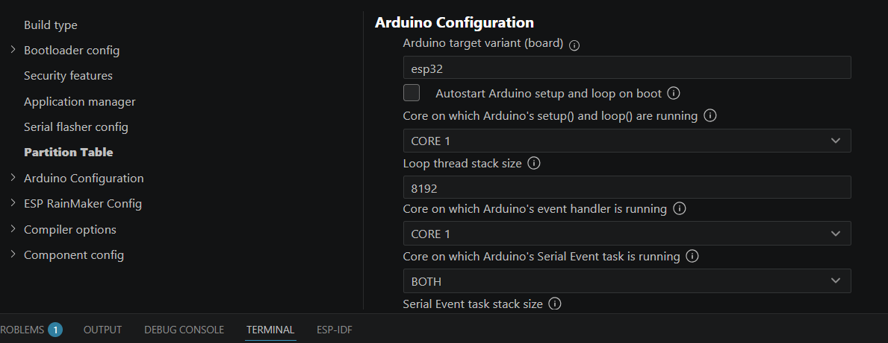

# ESP-IDF Arduino Component Example

Este proyecto demuestra cómo integrar el *framework* de **Arduino** como un componente dentro de un proyecto nativo de **ESP-IDF**.

Permite combinar la potencia y las herramientas profesionales de ESP-IDF con la simplicidad de las librerías de Arduino para el microcontrolador ESP32.

---

## 🛠️ Modos de Ejecución (menuconfig)

El proyecto permite elegir la estructura del código mediante `sdkconfig`. Puedes seleccionar entre el punto de entrada nativo de ESP-IDF (`app_main`) o la estructura tradicional de Arduino (`setup` y `loop`).

### Cómo cambiar el modo:

1. Abre la herramienta de configuración:
   ```bash
   idf.py menuconfig
   ```


   ### USAR `app_main`

    Si queremos usar app_main podemos configurar el proyecto de la siguiente manera.

   


Luego debemos usar un codigo de este estilo:
```c

#include "Arduino.h"

extern "C" void app_main(void)
{
    // Inicializa los componentes internos de Arduino (HAL, timers, etc.)
    initArduino();

    Serial.begin(115200);
    while(!Serial){
        ; // Espera a que el puerto serie se conecte
    }

    int counter = 0;
    char buff[25] = {0};

    // Bucle principal (equivalente al loop)
    while (true) {
        sprintf(buff, "Counter=%d\n", counter);
        Serial.print(buff);
        
        delay(1000); // Función de retardo de Arduino/FreeRTOS
        counter++;
    }
}


```